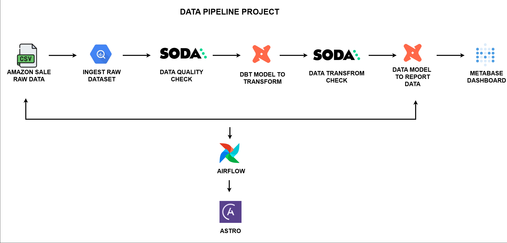
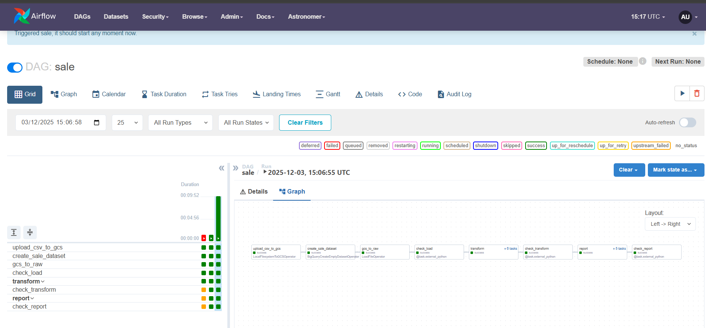

# Amazon Sale Data Pipeline

End-to-end pipeline for processing Amazon sales datasets from ingestion, data quality checks, transformation with dbt, to visualization in Metabase.

---

## Dataset

The dataset used is from Kaggle:

[Amazon Sale](https://www.kaggle.com/datasets/thedevastator/unlock-profits-with-e-commerce-sales-data?select=Amazon+Sale+Report.csv).

---

## Project Overview

[](Amazon%20Sale%20Data%20Pipeline.pdf)

This project simulates an end-to-end Data Engineering workflow aligned with real industry practices, including:

- Designing scalable and robust data architectures
- Building pipelines for extract → transform → load (ETL/ELT)
- Performing data quality checks using Soda
- Managing data warehouses and data marts
- Implementing data transformations and governance
- Optimizing storage and data processing
- Collaborating with data scientists and analysts to deliver reliable data

---

## 🛠️ How to Run

### Clone Repository

```
git clone https://github.com/dikcoding/amazon-sales-data-pipeline
cd amazon-sales-data-pipeline
```

### Start Docker

```
docker-compose up -d
```

### Start Astro

```
astro dev start
```

### Access Services

```
| 🔧 Service | 🌐 URL                 |
|------------|-------------------------|
| Airflow    | http://localhost:8080   |
| Metabase   | http://localhost:3000   |
```

---

## Data Pipeline



## Airflow DAG Overview



---

## Data Modeling


---

## Dashboard


